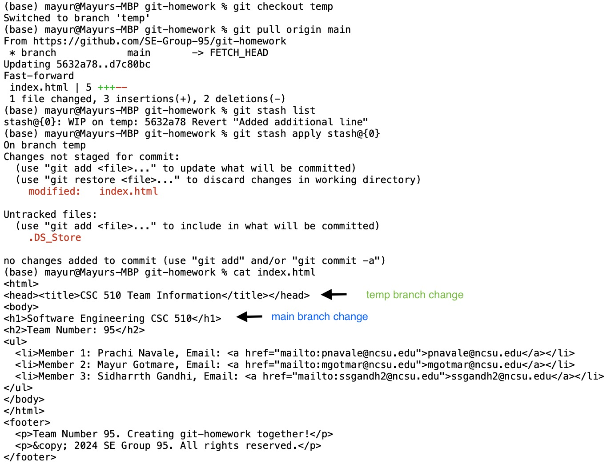

# CSC 510 Software Engineering 
## HW-5: [Reference Link](https://txt.github.io/se24fall/git.html)

### Webpage

### Step 9 - Stash Changes:

1. Create a new branch named “temp”, and make some changes but do not commit them. Use git stash to save the changes.

2. Switch to the main branch and make another commit.

3. Switch back to your “temp” branch and apply the stashed changes using git stash apply.

## Group Members:
1. Prachi Madhukar Navale
2. Mayur Prakash Gotmare
3. Sidharrth Sudeish Gandhi